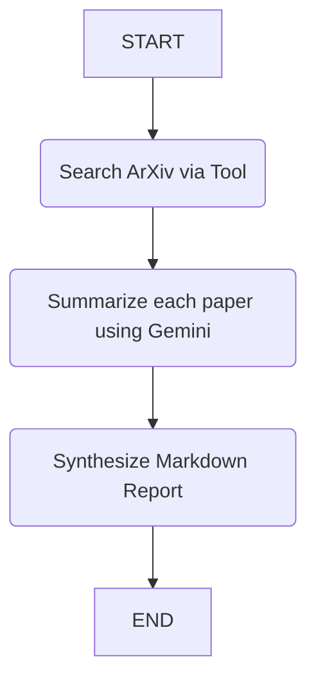

# ArXiv Research Agent
*(Powered by LangGraph & Google Gemini)*

An open-source, production-ready research agent that autonomously fetches academic papers from ArXiv and synthesizes them into a highly readable, comprehensive Markdown report. 

This project aims to demonstrate the capabilities of **LangGraph** (for state machine and control flow tracking) and **Google Gemini** (for fast, structured instruction-following and content summarization).

## Features
- **Retrieval-Augmented Generation (RAG)**: Automatically searches ArXiv for specific academic topics.
- **Resilience**: Implements retry logic (`tenacity`) to seamlessly handle rate limits or ArXiv API timeouts gracefully.
- **Structured Pydantic Validation**: Ensures the LLM strictly returns data using desired schemas (Methodology, Contributions, Limitations) before drafting.
- **Professional Output**: Synthesizes ideas creatively and outputs a professional, highly readable Markdown report.
- **Modular Pipeline**: Decouples State, Nodes, and APIs, highly extensible for more complex logic.

## Architecture / System Design
The agent is orchestrated as a directed graph powered by `langgraph`.
1. `search_node`: Connects to ArXiv using the `arxiv` library, retrieving up to `MAX_PAPERS_TO_FETCH` results.
2. `summarize_node`: Loops serially across retrieved papers to summarize key details into a structured JSON using `JsonOutputParser`.
3. `report_node`: Compiles all independent summaries, identifies thematic overlaps, and authors a final synthesized academic Markdown report.



## Getting Started

### 1. Requirements

Make sure you have Python 3.10+ installed.

### 2. Setup

Clone the repository and install dependencies:
```bash
python -m venv venv
# On Windows:
venv\Scripts\activate
# On macOS/Linux:
source venv/bin/activate

pip install -r requirements.txt
```

### 3. API Keys

Create an environment file:
```bash
cp .env.example .env
```
Open `.env` and fill in your Gemini API key:
`GEMINI_API_KEY=your_google_ai_studio_api_key_here`

### 4. Running the Agent

Provide any technical research topic via the CLI:
```bash
python main.py "Agents in Software Engineering"
```
The agent will execute its pipeline and automatically save the output inside the `reports/` folder.

## Future Work
Currently, `summarize_node` parses retrieved papers serially for design simplicity. Due to the modular framework, this can be seamlessly upgraded to execute concurrent LLM calls (via `asyncio.gather` or ThreadPoolExecutor) to drastically reduce latency when summarizing multiple papers.
